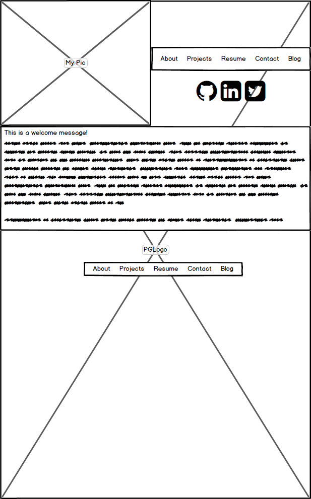
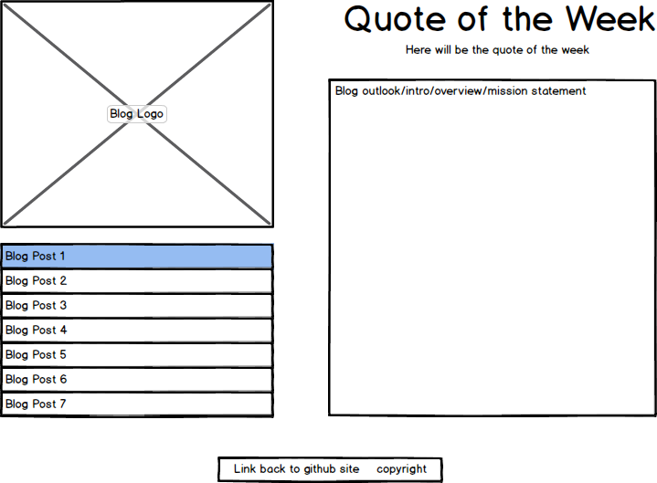

#Wireframe-index

#Wireframe-blog-index

#What is a wireframe?
A wireframe refers to a development technique that helps 
a designer come up with a pretty concrete vision of what 
a final project look like. Wireframes are often done in 
grayscale, rarely fill in photos or type, and can be done
on paper or any number of programs. They are often 
preceded by sketching or creating a mood board, and are 
often the product of research and information gathering. 

#What are the benefits of wireframing?
The benefits of wireframing are numerous. They can help
determine what needs to included and excluded from a 
project, as well as what may be consolidated. They can
help you see what will fit in a space in terms of 
graphical composition. A wireframe can influence to 
a great deal the final look of a website. 

#Did you enjoy wireframing your site?
Immensely. I started doing thumbnail sketches in
Photoshop, so by the time I did my wireframe, I had a
pretty good direction to go on each project. Wireframing
helped me see which ideas I had sketched worked,
which ones needed to be changed, and which ones 
needed to be scrapped altogether. 

#Did you revise your wireframe or stick with your first idea?
I did one I liked right away for the blog page, but I did
3 versions of the index page because I just wasn't
happy with it at first. 

#What questions did you ask during this challenge? 
#What resources did you find to help you answer them?
I have a background in Graphic Design, so this challenge
was really comfortable for me. 
I asked myself what I had to work with for starters. I
definitely had some images I knew I wanted to include,
and did have to whip up a few more and play with colors
in [kuler.com](http://kuler.com/ "Awesome for picking colors")
for a few minutes to come up with something I liked. 
I then sketched about 20 thumbnail sketches to figure
out what kind of elements and setups I needed.  
I would like to share that 
[dafont.com](http://dafont.com/ "Free Fonts!") is the
best place I have found to download fonts to my local
system. You do have to check out that it is free for 
the terms you need. 
I have been using Balsamiq for the actual wireframes, and
I really like it. Balsamiq makes it really easy to do
different versions on the fly for comparison. 

#Which parts of the challenge did you enjoy and which parts did you find tedious?
I pretty much enjoyed this from start to finish. I 
like playing with colors, sketching, and doing layouts
(wireframes). I feel like a person would really be
doing themselves an injustice to skimp over
this step. It can save you a big headache halfway
through your project and come up with a better
thought out solution. 

