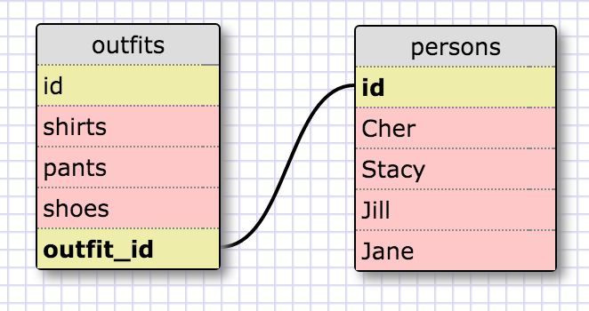

My schema - (this was maybe the hardest part of this whole challenge - the schema creator 
is extremely counter-intuitive in practice.)

***RELEASE 5 - SELECTing***

1. Select all data for all states.

sqlite> SELECT * FROM states;

2. Select all data for all regions.

sqlite> SELECT * FROM regions;

3. Select the state_name and population for all states.

sqlite> SELECT state_name, population FROM states;

4. Select the state_name and population for all states ordered by population. The state with the highest population should be at the top.

sqlite> SELECT state_name, population FROM states ORDER BY population DESC;

5. Select the state_name for the states in region 7

sqlite> SELECT state_name FROM states WHERE region_id = 7;

6. Select the state_name and population_density for states with a population density over 50 ordered from least to most dense.

sqlite> SELECT state_name, population_density FROM states WHERE population_density > 50 ORDER BY population_density ASC;

7. Select the state_name for states with a population between 1 million and 1.5 million people.

sqlite> SELECT state_name FROM states WHERE population BETWEEN 1000000 AND 1500000;

8. Select the state_name and region_id for states ordered by region in ascending order

sqlite> SELECT state_name, region_id FROM states ORDER BY region_id ASC;

9. Select the region_name for the regions with "Central" in the name.

sqlite> SELECT region_name FROM regions WHERE region_name LIKE '%Central%';

10. Select the region_name and the state_name for all states and regions in ascending order by region_id. Refer to the region by name. (This will involve joining the tables).

SELECT regions.region_name, states.state_name FROM states JOIN regions ON regions.id = states.region_id ORDER BY regions.id ASC;

**Reflection**
What are databases for?

Databases are for organizing data while keeping data secure and accurate. 
When we have a set of data tables, we can connect them with keys (either primary of foreign)
in such a way that we can pull the information we need from one or several tables and combine
them into new tables containing only the information we need. For this, we use a 
Structured Query Languague (SQL).

What is a one-to-many relationship?

A one-to many relationship refers to the use of primary and foreign keys to sort of navigate 
between different tables in a database. So basically, you would have ONE table that has MANY 
different tables referring back to it. 

What is a primary key? What is a foreign key? How can you determine which is which?

A primary key is a column that serves as a unique identifier for a row in the table. Values 
in this column must be unique and cannot be NULL. The primary key is literally an id value for a record. 
A table can have only one primary key. 

A foreign key is a column in a different table that contains the primary key to another table in the 
database. It is used to identify a particular row in the referenced table. You do this using a JOIN, of which 
there are a few from which to choose, including JOIN, INNER JOIN, and LEFT OUTER JOIN.

How can you select information out of a SQL database? What are some general guidelines for that?

The keyword SELECT is indispensable in this case. You will need to know which column and which table you are 
querying, so a simple query would look like numbers one and two above. The * is a kind of universal selector that just
returns everything from a table. It can be helpful when figuring out the contents available in a table, kind of like when we use ls on the command line just to look at the contents of a directory. 