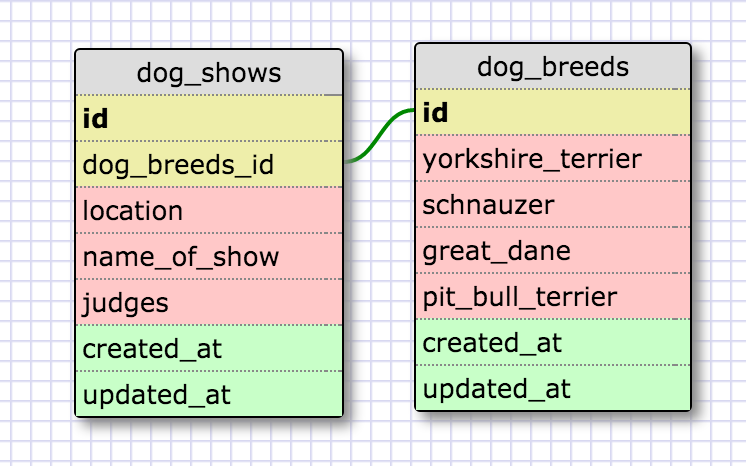
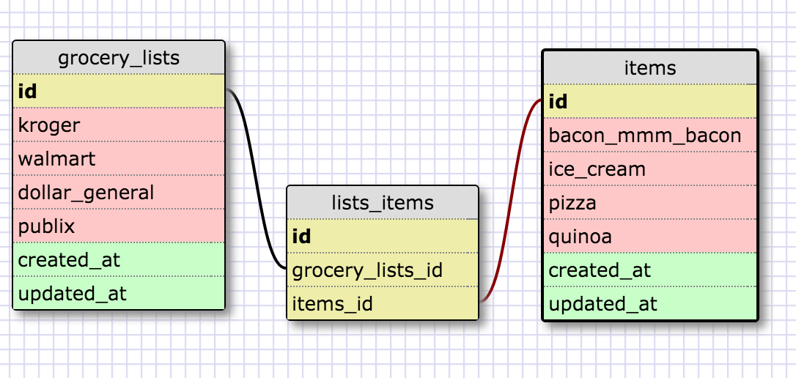

<!-- Link to images below -->
<!--  -->

*** Reflection ***
------------------

What is a one-to-one database?

A one-to-one database is essentially a pairing. In a one-to-one database, each row
from the first table must have a match in the second table. One thing to consider
when constructing tables is that when using a one-to-one relationship, make sure
that it is necessary and that it improves performance.

When would you use a one-to-one database? (Think generally, not in terms of the example you created).

You could use a one-to-one relationship when you have information that is not used as frequently. 
You could separate that from the other information. Honestly, it feels like this type of relationship will not be as useful.

What is a many-to-many database?

A many-to-many database feels like a more realistic option in many cases. A many-to-many relationship is hard to get too complicated in discussing because it literally is all in the name. It is where many tables may relate to many other tables. 
A 3rd table is often used in a many-to-many database schema to show such a relationship. 

When would you use a many-to-many database? (Think generally, not in terms of the example you created).

When a single fact can relate to many database tables. 

What is confusing about database schemas? What makes sense?

Database schemas are basically just like charts of how different tables of data relate to one another. It can be a little tricky to consider how they may relate when there are multiple tables - of which there can be many many. I think the best practice would be to just make a whole bunch and think about how they will work together in a real world challenge scenario. 

